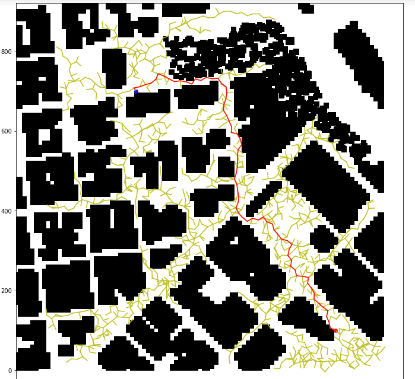

Writeup of the solution for the 3D motion planning
===

Explain the Starter Code
------

Comparing Backyard_flyer and motion_planning files

There are issues reported in GH and Udacity knowledge which make it hard to fly a drone as it's stuck "in the building"
https://github.com/udacity/fcnd-issue-reports/issues/392
https://knowledge.udacity.com/questions/837815
After using specific version of the simulator 0.1.0 for motion planning only there is a way to fly a drone "through the roof" but landing transition never finishes 
as the drone lands on the roof instead on the ground.

Motion_planning has an extra state PLANNING between ARMING and TAKEOFF - as this can take significant time - 
and a corresponding transition between states in functions `state_callback` and `plan_path`.
It also have 2 new methods `send_waypoints` (for visualisations) and `plan_path` - which has a skeleton of useful prep work for planning and TODOs to finish the project.

planning_utils contains useful methods which were re-used few times in previous excercises like:
 - create_grid - reads provided csv file with obstacles and and creates a 2D np.array grid for a specific altitude and other metadata
 - a_star - grid based a_star algorithm with valid movements in 4 directions
 - valid_actions - function which returns only 4 directions of movement NEDU
 - heuristic - euclidian distance between 2 points (it is used in a_star algorithm)

plan_path function:
 - sets important parameters for the planning like altitude, safety distance from obstacles, start and goal positions
 - then executes a_star to find the path from start to goal and sends waypoints to the simulator for visualisation.

Prep work:
---
- reading lat0 and lon0 from csv is implemented in function `read_home_location` and set as global home on line 165
- I calculate local_start at line 172 and then at 189 set grid_start as grid index offset from local position (as int)
- the step above allows to start from anywhere (verified by multiple consecutive starts from previous goals) - NOTE: I hoped I could set an arbitrary start position in simulator but it seems not possible.
- at line 185 I calculate local_goal from GLOBAL_GOAL (set as (lat, lon, alt)) and then convert it in to a grid goal 

Implementation: RRT and replanning with BFS
---
- I chose RRT as the method is very interesting and I saw it was used as a benchmark paper for Anytime A* algorithm.
- Firstly I finished the RRT implementation from the RRT excercise to use graph based A* search on the tree and visualized 
in jupyter notebook to have a feel for best parameters of **dt** and **number of vertices**
- Best results were achieved with number of vertices 5000 and dt 10 but that was very slow so num=2000 and dt=20 was acceptable with rare collision (see picture below)

- In simulator, however, I had problems with connection. In both grid based A* and RRT if calculation of the plan took approximately more than 10 seconds, the program crashed with error `ConnectionResetError: [Errno 54] Connection reset by peer`.
- Because of the above I changed number of vertices to 500 and raised dt to 40 which gave fast results but edges quite often went through the obstacles. Parameters can be changed in **plan_path** method on line 182
- So I decided to implement local re-planner - for each waypoint, I check with bresenham method if there is a collision and if yes, I create a new local plan which goes around the obstacle to the next free waypoint. This is implemented in **waypoint_transition** method

In general there were multiple issues with the simulator which limited optimal planning but that somewhat simulated imperfect real-world conditions and required some extra work for more robust solution with local re-planning.

This is the drone in action following waypoints
